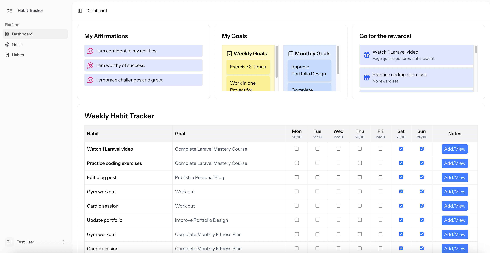
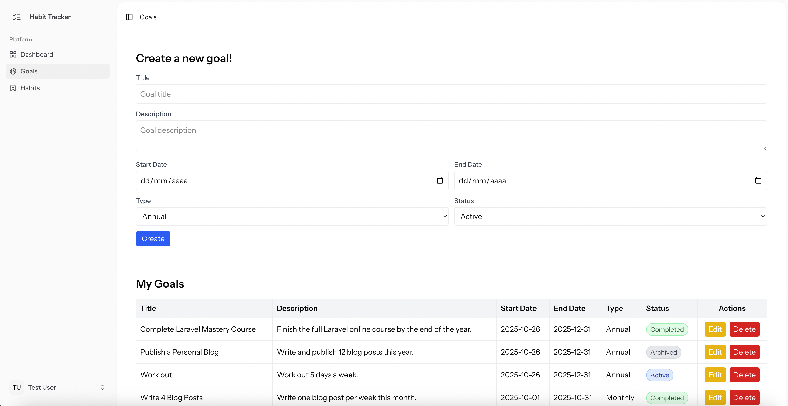
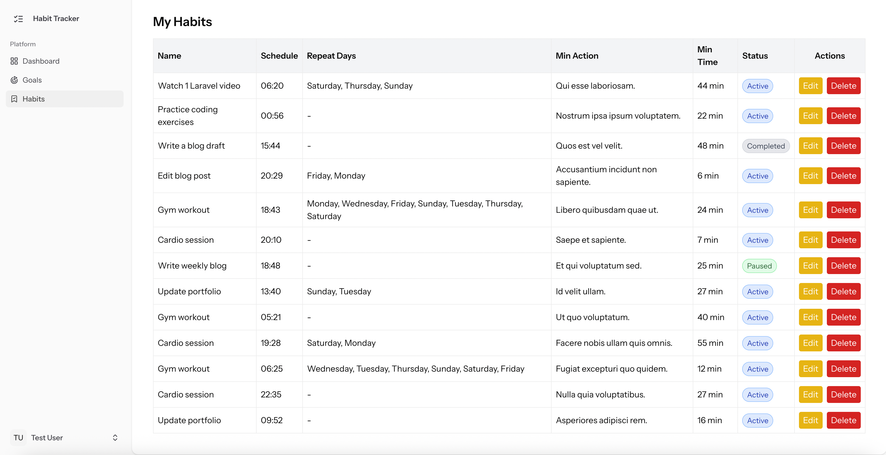
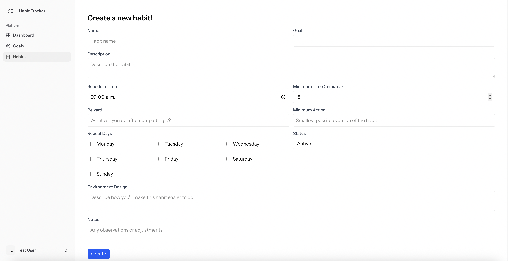

# Habit Tracker

[Leer en español](./README.es.md)

This project is a habit tracker and system builder inspired by the ideas of James Clear’s Atomic Habits.
Instead of focusing only on goals, it helps you design identity-based systems — daily actions that make consistency natural and sustainable.

## How It Works
The app allows users to:

📋 **Create, edit, and delete Goals and Habits:**

Organize your objectives and the daily actions that help you achieve them, both weekly and monthly.

📅 **Use an interactive Habit Tracker:**

Log your progress day by day, add notes and reminders, and visually track your consistency over the week.

💭 **View affirmations and motivational quotes:**

Stay inspired with positive phrases that support your mindset and reinforce your process.

🎯 **Review your weekly and monthly goals at a glance:**

Quickly recall what you’re working toward and stay focused on what truly matters.

🏆 **Associate rewards with your habits:**

Celebrate your progress and strengthen the habit loop with meaningful incentives.

> “You do not rise to the level of your goals. You fall to the level of your systems.” — James Clear

---

## Requirements

- **PHP** ^8.2
- **Composer** ^2.7
- **Laravel** ^12.x
- **MySQL** ^8.0
- **Node.js** ^22.12+
- **Npm** ^10.x
- **Vue.js** ^3.5.13

---

## Installation

1. **Clone the repository**
   ```bash
   git clone https://github.com/judyz94/habit-tracker.git
   cd habit-tracker

2. **Install Laravel Dependencies**
   ```bash
   composer install

3. **Configure the .env file**

   Copy the sample file and edit it with the specific DB credentials:
   ```bash
   cp .env.example .env

4. **Generate the application key**
   ```bash
   php artisan key:generate
   
5. **Create DB in MySQL**

   The default name in the .env.example is "habit_tracker"


6. **Run migrations and seeders**
   ```bash
   php artisan migrate --seed

7. **Set the correct Node.js version**
   
    Before compiling the assets, make sure you are using the correct Node.js version
   ```bash
   nvm install 20
   nvm use 20

8. **Install Node.js Dependencies**
   ```bash
   npm install
   
9. **Compile the assets**
   ```bash
   npm run dev

10. **Start the local web server**
    ```bash
    php artisan serve

11. **Access the application**

    After the server is running, open your browser and go to the URL shown in the terminal (usually http://127.0.0.1:8000)

    Click on the **Login** option, or go directly to http://127.0.0.1:8000/login and log in using the following test user credentials:

    > ```php
    > 'email' => 'test@example.com'
    > 'password' => '1234'
    > ```

12. **Run the tests**

    To execute the test suite, you can use either of the following commands:

    Run tests using Laravel's built-in test runner:
    ```bash
    php artisan test
    ```
    
    Or, to generate a code coverage report in HTML:
    ```bash
    vendor/bin/phpunit --coverage-html coverage
    
---

## Authentication & API Overview

This project provides a secure RESTful API built with Laravel Sanctum.  
Users can register, log in, and manage their personal goals, habits, and affirmations through authenticated routes.


### Authentication Flow

The authentication system uses **Laravel Sanctum** tokens.  
Users must first register or log in to obtain an **API token**, which must be included in subsequent requests via the `Authorization` header.

#### Headers Example
```http
Authorization: Bearer your_api_token_here
Accept: application/json
```

### Authentication API

**Base route:** `/api`

| Method | Endpoint         | Description                     | Auth Required |
|--------|------------------|----------------------------------|----------|
| POST   | `/api/register`  | Register a new user              | No      |
| POST   | `/api/login`     | Log in and receive an API token  | No      |
| POST   | `/api/logout`    | Log out and revoke the token     | Yes     |
| GET    | `/api/user`      | Retrieve the authenticated user  | Yes     |

---

## Protected API Endpoints

All routes below require authentication (`auth:sanctum` middleware).


### Goals API

**Base route:** `/api/goals`

| Method | Endpoint             | Description                  |
|--------|----------------------|------------------------------|
| GET    | `/api/goals`         | List all user goals          |
| GET    | `/api/goals/{id}`    | Get a specific goal          |
| POST   | `/api/goals`         | Create a new goal            |
| PUT    | `/api/goals/{id}`    | Update an existing goal      |
| DELETE | `/api/goals/{id}`    | Delete a goal                |
| GET    | `/api/goals/weekly`  | Retrieve weekly goals        |
| GET    | `/api/goals/monthly` | Retrieve monthly goals       |

---

### Habits API

**Base route:** `/api/habits`

| Method | Endpoint              | Description                  |
|--------|-----------------------|------------------------------|
| GET    | `/api/habits`         | List all user habits         |
| GET    | `/api/habits/{id}`    | Get a specific habit         |
| POST   | `/api/habits`         | Create a new habit           |
| PUT    | `/api/habits/{id}`    | Update an existing habit     |
| DELETE | `/api/habits/{id}`    | Delete a habit               |
| GET    | `/api/habits/active`  | Retrieve all active habits   |

---

### Affirmations API

**Base route:** `/api/affirmations`

| Method | Endpoint                   | Description              |
|--------|----------------------------|--------------------------|
| GET    | `/api/affirmations`        | List all affirmations    |
| POST   | `/api/affirmations`        | Create a new affirmation |
| PUT    | `/api/affirmations/{id}`   | Update an affirmation    |
| DELETE | `/api/affirmations/{id}`   | Delete an affirmation    |

---

### Habit Logs API

**Base route:** `/api/habit-logs`

This resource tracks daily progress for each habit  
(e.g., marking a habit as completed for a specific day).

| Method | Endpoint                  | Description             |
|--------|---------------------------|-------------------------|
| GET    | `/api/habit-logs`         | List habit logs         |
| POST   | `/api/habit-logs`         | Record a daily habit log|
| PUT    | `/api/habit-logs/{id}`    | Update a habit log      |
| DELETE | `/api/habit-logs/{id}`    | Delete a habit log      |

---

## Application Functionalities

### Dashboard 
After logging in, you’ll be taken to the Dashboard, which serves as the main page of the application.
The dashboard is divided into four main sections:



#### 1. Weekly Habit Tracker
Displays your active habits for the current week.
Here you can check off each day you completed a habit and add notes for each one.

####  2. My Affirmations
Lists a set of motivational affirmations to help you stay focused and positive.

#### 3. My Goals
Shows your weekly and monthly goals, allowing you to keep track of your progress over time.

####  4. Go for the Rewards!
Displays the rewards associated with each habit once you achieve them — your motivation boosters!

---

### Goals Menu

This section lets you define your personal or professional objectives.
Each Goal represents a broader purpose — something you want to achieve over a specific period.



#### Fields and behavior:

- Title: A short name describing the goal.
- Description: A detailed explanation of what the goal is about.
- Type: Can be annual, monthly or weekly, helping organize goals by time frame.
- Start Date / End Date: Define when the goal starts and when it should be completed.
- Status: Indicates whether the goal is active, completed, or archived.

Goals can be linked to one or more habits, which serve as the systems or actions you’ll repeat to achieve them.

**From the interface, you can:**

1. Create new goals.
2. Edit existing ones.
3. Change goal status.
4. Delete goals no longer relevant.
5. View all your goals in a list.

---

### Habits Menu

Habits are the repetitive actions that support your goals.
Each habit can be tied to a goal and includes flexible scheduling and tracking options.



### Habits form



#### Fields and behavior:
- Goal: Links the habit to a specific goal.
- Name: The name of the habit (e.g., “Read 20 pages” or “Go to the gym”).
- Description: Explains what the habit involves.
- Schedule Time: The time of day the habit is meant to be performed.
- Repeat Days: An array defining the days of the week the habit repeats (e.g., [“Mon”, “Wed”, “Fri”]).
- Min Action / Min Time: The minimum measurable effort to count as completed (e.g., 10 push-ups or 15 minutes).
- Environment Design: Notes on how to set up your environment to make the habit easier (e.g., “Leave water bottle near desk”).
- Reward: The reward associated with successfully maintaining the habit.
- Notes: A space for personal reflections or adjustments.
- Status: Tracks whether the habit is active, completed, or paused.

**From the interface, you can:**

1. Create new habits linked to a specific goal.
2. Edit any habit’s details (like frequency, reward, or environment setup).
3. Change habit status.
4. Delete habits.
5. View all your habits in a list.

---
